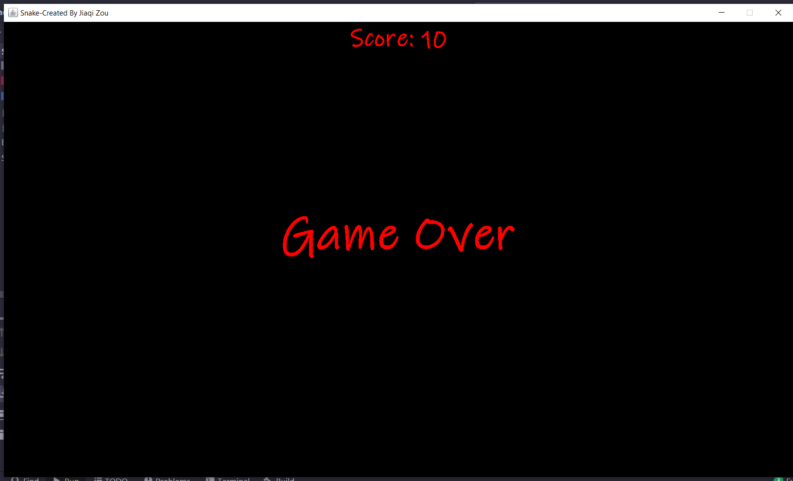

# Snake-Game

## Snake

Snake is an older classic video game. It was first created in late 70s. Later it was brought to PCs. In this game the player controls a snake. The objective is to eat as many apples as possible. Each time the snake eats an apple its body grows. The snake must avoid the walls and its own body. This game is sometimes called Nibbles.

## Code design

In the initGame() method we create the snake, randomly locate an apple on the board, and start the timer. ... We call the locateApple() method which randomly positions a new apple object. In the move() method we have the key algorithm of the game. To understand it, look at how the snake is moving. Of course, we need to prevent the snake from making a 180 degree turn.

The size of each of the joints of a snake is 10 px. The snake is controlled with the cursor keys. Initially, the snake has three joints. If the game is finished, the "Game Over" message is displayed in the middle of the board.
